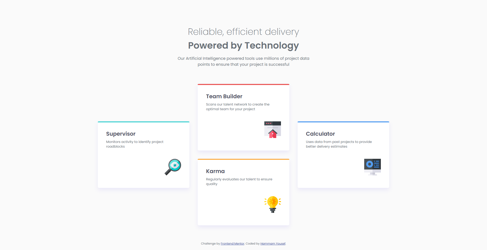

# Frontend Mentor - Four card feature section solution

This is a solution to the [Four card feature section challenge on Frontend Mentor](https://www.frontendmentor.io/challenges/four-card-feature-section-weK1eFYK). Frontend Mentor challenges help you improve your coding skills by building realistic projects.

## Table of contents

- [Overview](#overview)
  - [The challenge](#the-challenge)
  - [Screenshot](#screenshot)
  - [Links](#links)
- [My process](#my-process)
  - [Built with](#built-with)
  - [What I learned](#what-i-learned)
  - [Continued development](#continued-development)
  - [Useful resources](#useful-resources)
- [Author](#author)

## Overview

### The challenge

Users should be able to:

- View the optimal layout for the site depending on their device's screen size

### Screenshot



### Links

- Solution URL: https://www.frontendmentor.io/solutions/responsive-four-cards-using-flex-and-grid-SDpOinCjBz
- Live Site URL: https://hammamyousef.github.io/four-card-feature-section/

## My process

### Built with

- Semantic HTML5 markup
- CSS custom properties (variables)
- Flexbox
- CSS Grid
- Mobile-first workflow
- [Poppins](https://fonts.google.com/specimen/Poppins) font from Google Fonts

### What I learned

- How to use CSS Grid for complex layouts and make them responsive with media queries.
- Leveraged CSS custom properties for consistent theming.
- Improved skills in structuring semantic HTML and using utility classes for typography.

#### Example: Responsive grid layout

```css
section {
  display: grid;
  grid-template-columns: repeat(3, 1fr);
  grid-template-rows: repeat(2, 1fr);
  gap: 2rem;
}
@media screen and (max-width: 768px) {
  section {
    grid-template-columns: repeat(2, 1fr);
    grid-template-rows: repeat(2, 1fr);
  }
}
@media screen and (max-width: 504px) {
  section {
    grid-template-columns: 1fr;
    grid-template-rows: repeat(4, 1fr);
  }
}
```

### Continued development

- Explore more advanced CSS Grid patterns.
- Experiment with accessibility improvements.
- Try implementing the same layout using a JavaScript framework for comparison.

### Useful resources

- [CSS Grid Guide](https://css-tricks.com/snippets/css/complete-guide-grid/) - Helped with grid layout.

## Author

- Frontend Mentor - [@HammamYousef]https://www.frontendmentor.io/profile/HammamYousef
